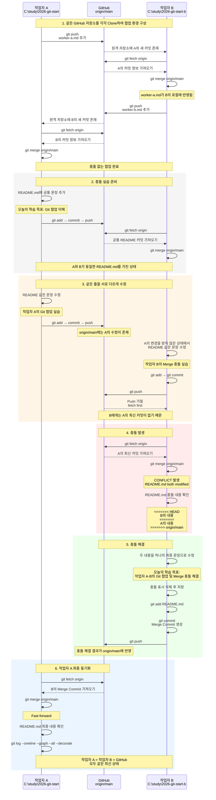

# 2026-git-start
2026-git-start
로컬 컴퓨터에서 추가한 내용입니다.
GitHub 웹에서 누군가가 수정한 내용입니다

오늘의 학습 목표: 작업자 A·B의 Git 협업 및 Merge 충돌 해결

```mermaid
sequenceDiagram
    participant A as 작업자 A<br/>C:\study\2026-git-start
    participant G as GitHub<br/>origin/main
    participant B as 작업자 B<br/>C:\study\2026-git-start-b

    Note over A,B: 1. 같은 GitHub 저장소를 각각 Clone하여 협업 환경 구성

    A->>G: git push<br/>worker-a.md 추가
    G-->>B: 원격 저장소에 A의 새 커밋 존재

    B->>G: git fetch origin
    G-->>B: A의 커밋 정보 가져오기
    B->>B: git merge origin/main
    Note over B: worker-a.md가 B의 로컬에 반영됨

    B->>G: git push<br/>worker-b.md 추가
    G-->>A: 원격 저장소에 B의 새 커밋 존재

    A->>G: git fetch origin
    G-->>A: B의 커밋 정보 가져오기
    A->>A: git merge origin/main
    Note over A,B: 충돌 없는 협업 완료

    rect rgb(245, 245, 245)
        Note over A,B: 2. 충돌 실습 준비

        A->>A: README.md에 공통 문장 추가
        Note over A: 오늘의 학습 목표: Git 협업 이해

        A->>G: git add → commit → push

        B->>G: git fetch origin
        G-->>B: 공통 README 커밋 가져오기
        B->>B: git merge origin/main

        Note over A,B: A와 B가 동일한 README.md를 가진 상태
    end

    rect rgb(255, 245, 230)
        Note over A,B: 3. 같은 줄을 서로 다르게 수정

        A->>A: README 같은 문장 수정
        Note over A: 작업자 A의 Git 협업 실습

        A->>G: git add → commit → push
        Note over G: origin/main에는 A의 수정이 존재

        B->>B: A의 변경을 받지 않은 상태에서<br/>README 같은 문장 수정
        Note over B: 작업자 B의 Merge 충돌 실습

        B->>B: git add → git commit
        B->>G: git push

        G--xB: Push 거절<br/>fetch first
        Note over B,G: B에게는 A의 최신 커밋이 없기 때문
    end

    rect rgb(255, 235, 235)
        Note over B,G: 4. 충돌 발생

        B->>G: git fetch origin
        G-->>B: A의 최신 커밋 가져오기

        B->>B: git merge origin/main

        Note over B: CONFLICT 발생<br/>README.md both modified

        B->>B: README.md 충돌 내용 확인

        Note over B: <<<<<<< HEAD<br/>B의 내용<br/>=======<br/>A의 내용<br/>>>>>>>> origin/main
    end

    rect rgb(235, 255, 235)
        Note over B,G: 5. 충돌 해결

        B->>B: 두 내용을 하나의 최종 문장으로 수정
        Note over B: 오늘의 학습 목표:<br/>작업자 A·B의 Git 협업 및 Merge 충돌 해결

        B->>B: 충돌 표시 삭제 후 저장
        B->>B: git add README.md
        B->>B: git commit<br/>Merge Commit 생성

        B->>G: git push
        Note over G: 충돌 해결 결과가 origin/main에 반영
    end

    rect rgb(235, 245, 255)
        Note over A,G: 6. 작업자 A 최종 동기화

        A->>G: git fetch origin
        G-->>A: B의 Merge Commit 가져오기

        A->>A: git merge origin/main
        Note over A: Fast-forward

        A->>A: README.md 최종 내용 확인
        A->>A: git log --oneline --graph --all --decorate

        Note over A,B: 작업자 A = 작업자 B = GitHub<br/>모두 같은 최신 상태
    end
```
